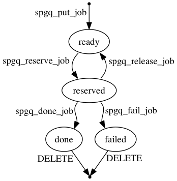

# spgq

Small and simple queue for PostgreSQL 9.5+.


## Schema

 Column           | Type        | Modifiers   | Description
------------------|-------------|-------------|-------------
 id               | bigint      | PRIMARY KEY | unique job identifier
 queue            | varchar     | NOT NULL    | job queue
 args             | jsonb       | NOT NULL    | job arguments
 status           | varchar     | NOT NULL    | job status: ready, reserved, done, failed
 last_reserved_by | varchar     |             | identifier of the last client who reserved a job, may be NULL
 last_error       | text        |             | last job release error, may be NULL
 releases         | integer     | NOT NULL    | how many times job was released
 created_at       | timestamptz | NOT NULL    | job creation time
 updated_at       | timestamptz | NOT NULL    | last job update time
 reserve_after    | timestamptz |             | earliest job reservation time, NULL means anytime

```sql
spgq_put_job(p_queue varchar, p_args jsonb, p_reserve_after timestamptz) RETURNS spgq_jobs
```
Puts new job to given queue with ready status, with given arguments and earliest reservation time.

```sql
spgq_reserve_job(p_queue varchar, p_client varchar) RETURNS SETOF spgq_jobs
```
Reserves a ready job from given queue for given client. May return 0 or 1 row.

```sql
spgq_release_job(p_job_id bigint, p_error text, p_reserve_after timestamptz) RETURNS SETOF spgq_jobs
```
Releases a given reserved job with given error message and earliest reservation time back to ready status.

```sql
spgq_done_job(p_job_id bigint) RETURNS SETOF spgq_jobs
```
Marks given reserved job as done.

```sql
spgq_fail_job(p_job_id bigint, p_error text) RETURNS SETOF spgq_jobs
```
Marks given reserved job as failed with given error message.


## Job life-cycle




## Installation

```
psql -U <username> -f schema.sql <dbname>
```


## Authors

Created by [Alexandr Zaikin](https://github.com/zaikin) and [Alexey "AlekSi" Palazhchenko](https://github.com/AlekSi). Licensed under [MIT-style license](LICENSE).
